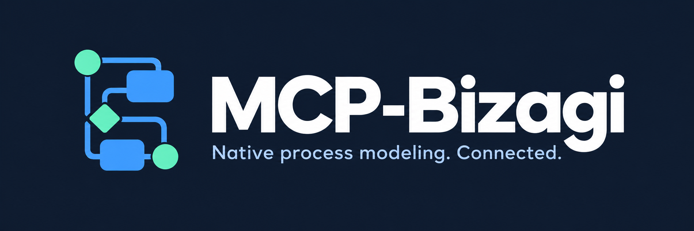

<div align="center">



# MCP-Bizagi

**Create, edit and work with Bizagi Modeler processes from your MCP-compatible AI assistant.**

[](https://github.com/h0w4r/MCP-Bizagi/actions/workflows/ci.yml)
[](https://github.com/h0w4r/MCP-Bizagi/releases)


[](LICENSE)

[Get started](#quick-start) · [See a real example](#real-example) · [Capabilities](#capabilities) · [Documentation](#documentation) · [Contribute](CONTRIBUTING.md)

</div>

MCP-Bizagi connects a local AI assistant to **Bizagi Modeler**, using the
[Model Context Protocol](https://modelcontextprotocol.io/). Your assistant interprets
the request; the server performs explicit modeling operations and returns files,
previews and verifiable results. The server needs no separate AI model or API key;
your MCP client manages its own AI provider.

Work with **BPMN and native `.bpm` files**, or use a **dedicated managed live editor**.
File operations do not drive the desktop with clicks or take over your foreground window.

> **Experimental, usable within its verified scope.** Native integration targets
> **Bizagi Modeler 4.3.0.008 on Windows x64**. The
> [0.7.0-alpha.1 package](https://github.com/h0w4r/MCP-Bizagi/releases/tag/v0.7.0-alpha.1)
> passed [six real end-to-end acceptance circuits](docs/validation-package-0.7.md).
> This is not complete Modeler parity: existing-window attachment and future
> engine versions are not assumed to work.

## Why MCP-Bizagi?

- **Native models, not just pictures.** Work with process structure, multiple
  diagrams, documentation, attributes, attachments and simulation settings.
- **Changes you can review.** Revision checks, staged copies, fidelity reports
  and explicit publication protect existing files from blind overwrites.
- **Local execution.** The installed Bizagi engine runs on your machine. Bizagi
  binaries are never bundled, patched or redistributed.
- **Saved and live workflows.** Edit files, or launch an MCP-managed editor with
  unsaved changes, undo/redo, checkpoints and recovery after an MCP disconnect.

Your AI client can still send tool inputs and outputs to its configured provider.
Local engine execution is not a promise of end-to-end offline AI processing.

## Capabilities

These groups summarize implemented workflows. Each linked contract describes
supported operations and its individual verification boundaries.

| Work you want to do | What the MCP provides | Details |
| --- | --- | --- |
| Create or inspect a process | BPMN input, blank native models, native IDs, revisions and multiple diagrams | [Models](docs/native-models.md) · [Tools](docs/tools.md) |
| Edit process structure | Batched tasks, events, gateways, connections, pools, lanes and subprocesses | [Editing](docs/native-editing.md) · [Containers](docs/native-containers.md) |
| Organize complex models | Diagram lifecycle, type conversion, reusable calls, extraction, inlining and reparenting | [Diagrams](docs/native-diagrams.md) · [Refactoring](docs/native-refactoring.md) · [Inlining](docs/native-inlining.md) |
| Improve presentation | Styles, labels, alignment, diagram layout, native SVG and transparent PNG output | [Layout](docs/native-diagram-layout.md) · [Styles](docs/native-styles.md) · [Rendering](docs/rendering.md) |
| Keep supporting content | Descriptions, extended attributes, embedded files, resources and RACI assignments | [Attributes](docs/native-attributes.md) · [Metadata](docs/native-simulation.md) |
| Exchange and publish | BPMN roundtrips, scoped XPDL/VDX exchange and document publication | [XPDL](docs/native-xpdl.md) · [VDX](docs/native-visio.md) · [Publication](docs/native-publication.md) |
| Work with simulation | Configured scenarios, what-if runs, structured results and saved results | [Simulation](docs/native-simulation.md) · [Saved results](docs/native-saved-simulation.md) |
| Use a live editor | Dedicated launch, name/documentation edits, history, checkpoints, publication and recovery | [Live sessions](docs/live-sessions.md) |

**Need an exact tool or limitation?** See the [tool reference](docs/tools.md) and
[full capability ledger](docs/capabilities.md). File editing is broader than the
current live-edit surface. BPMN exchange is not a lossless backup of every native field.

## Real example

### A HackerOne report lifecycle, built through the MCP

A user asked for a diagram explaining the HackerOne bug bounty reporting process.
MCP-Bizagi created and refined the model using the real installed engine—not a
mock renderer or an AI-generated picture of a diagram.

[](examples/hackerone-report-lifecycle/diagram.svg)

**11 activities · 4 decision gateways · 2 lanes · 20 sequence flows.**
The run saved a native `.bpm`, reopened the published file in a separate worker,
verified all 20 connections against the source and returned no native validation
findings. Labels are in Spanish, as requested in the original example.

[Open the full-size SVG](examples/hackerone-report-lifecycle/diagram.svg) ·
[BPMN source](examples/hackerone-report-lifecycle/source.bpmn) ·
[Reproduce it and inspect the evidence](examples/hackerone-report-lifecycle/README.md)

The preview has a transparent background. The banner above is brand artwork;
**this example is actual MCP/native-engine output**. It demonstrates one workflow,
not every feature or independent desktop-GUI compatibility.

## Quick start

### 1. Check the requirements

| Requirement | Needed for |
| --- | --- |
| Windows x64 | Running the server and native components |
| .NET 10 **x64 runtime** | Running the package; no SDK needed |
| .NET Framework 4.8 | Native worker and live companion |
| Bizagi Modeler **4.3.0.008**, installed separately | Native modeling, rendering, publication and simulation |
| MCP client with local **stdio** support | Connecting your assistant |

Managed live sessions additionally need an interactive Windows user session and
on-demand Task Scheduler access. They do not request elevation. Future Bizagi
versions require revalidation before native writes are enabled.

### 2. Download and extract

Download the Windows ZIP and its `.sha256` file from the
[release page](https://github.com/h0w4r/MCP-Bizagi/releases/tag/v0.7.0-alpha.1).
Compare the ZIP hash with the published checksum, then extract the complete
archive to a directory such as `C:/Tools/MCP-Bizagi`.

```powershell
Get-FileHash ./MCP-Bizagi-0.7.0-alpha.1-win-x64.zip -Algorithm SHA256
```

Keep the `worker/`, `live/` and `owner/` folders beside the server.
[Package verification guide →](docs/packaging.md#verify-extracted-bytes-and-provenance)

### 3. Connect your MCP client

Use absolute paths and a workspace containing only the models you intend to expose:

```json
{
  "mcpServers": {
    "bizagi-modeler": {
      "command": "dotnet",
      "args": ["C:/Tools/MCP-Bizagi/McpBizagi.Server.dll"],
      "env": {
        "MCP_BIZAGI_ROOT": "C:/Models",
        "MCP_BIZAGI_STATE": "C:/MCP-Bizagi-State",
        "MCP_BIZAGI_EXPERIMENTAL_NATIVE": "1"
      }
    }
  }
}
```

This is a generic example; your client's schema may differ. The package discovers
its companion executables and the installed Modeler. If needed, set
`BIZAGI_MODELER_PATH` to the **installation directory**, not the EXE. Restart the
MCP server after changing its environment. [All settings →](docs/configuration.md)

### 4. Try a modeling task

First ask your client to call `capabilities_get` to check the installed version,
available tools and missing prerequisites. Then try:

> Create a simple request-approval process with an approval decision and rejection
> path. Save it as a new native Bizagi model, validate it and show an SVG preview.
> Do not overwrite an existing model.

Or follow the [HackerOne walkthrough](examples/hackerone-report-lifecycle/README.md)
for explicit tool calls and a supplied source.

For existing files: `native_inspect` → revision-checked edits → review the new
artifact → `native_commit` to publish. Native calls return operation IDs: poll
`operation_get` and inspect the final result, not just its acknowledgment.
Never blindly replay a write after a disconnect.

For an interactive session, `live_open` takes a model path and its current revision.
It launches a **dedicated** editor, not an arbitrary existing window.
[Live workflow →](docs/live-sessions.md)

## How it works

The official C# MCP SDK handles stdio. The modern host coordinates explicit use
cases; isolated Windows processes load the locally installed Bizagi components.

| Layer | Responsibility |
| --- | --- |
| MCP client | Interpret your request and call explicit tools |
| .NET 10 host and core | Tool contracts, workspace rules, revisions and operation journals |
| .NET Framework 4.8 worker and adapter | Serialized native operations over user-restricted local pipes |
| Managed live owner and companion | Dedicated editor lifetime, unsaved state and recovery independent of the MCP process tree |

Native edit tools produce staged artifacts. Publishing to a new or existing
workspace file is a separate, guarded operation with readback and recoverable
backups. No arbitrary reflection or generic code-execution tool is exposed.

[Architecture](docs/architecture.md) · [Native fidelity](docs/native-fidelity.md) · [Publication and recovery](docs/native-commit.md)

## Verification

The [0.7 package acceptance record](docs/validation-package-0.7.md) documents
**58 MCP tools**, **six real extracted-package circuits** and **1,504 unit tests**.
These are results for that exact artifact, not universal compatibility claims.

- **Public CI:** build, unit/policy tests and real MCP XML acceptance.
- **Controlled Windows environment:** actual Bizagi persistence, editing, rendering
  and managed-session acceptance with durable evidence.
- **Separate boundary:** desktop visual compatibility is not inferred solely from
  file parsing or offscreen rendering.

Native tests do not run automatically on an operator machine for external pull
requests. [Per-feature validation records →](docs/validation.md)

<details>
<summary><strong>Build from source and run the checks</strong></summary>

Install the SDK selected by [`global.json`](global.json) and PowerShell 7.2+.

```powershell
git clone https://github.com/h0w4r/MCP-Bizagi.git
cd MCP-Bizagi
dotnet restore --locked-mode
dotnet build -c Release --no-restore
dotnet test tests/McpBizagi.Core.Tests -c Release --no-build

# Real stdio MCP client and durable XML files; no Bizagi installation required.
dotnet run --project tests/McpBizagi.Acceptance -c Release --no-build -- .

# Also exercise the supported installed native engine.
dotnet run --project tests/McpBizagi.Acceptance -c Release --no-build -- . --native

# Build a local Windows package; does not upload a release.
./scripts/package.ps1
```

Private evidence goes under ignored `.local/acceptance/` directories. Review
metadata before publishing native models or transcripts. Source builds need the
executable overrides in [configuration](docs/configuration.md); the quick-start
configuration assumes the extracted package layout.

</details>

## Documentation

| Looking for… | Start here |
| --- | --- |
| Setup or installation diagnosis | [Configuration](docs/configuration.md) · [Packaging](docs/packaging.md) |
| Exact arguments and results | [Tool reference](docs/tools.md) · [Examples](examples) |
| Supported features and limits | [Capability ledger](docs/capabilities.md) |
| Conflicts or interrupted writes | [Native commit](docs/native-commit.md) · [Live sessions](docs/live-sessions.md) |
| Design and evidence | [Architecture](docs/architecture.md) · [Validation](docs/validation.md) |
| A bug, idea or contribution | [Issues](https://github.com/h0w4r/MCP-Bizagi/issues) · [Contributing](CONTRIBUTING.md) |
| A security concern | [Security policy](SECURITY.md) |
| Release history | [Changelog](CHANGELOG.md) · [Releases](https://github.com/h0w4r/MCP-Bizagi/releases) |

## Safety and limitations

- Keep independent backups. Revision guards and fidelity checks do not replace them.
- Workspace confinement is a defensive boundary, not an operating-system sandbox.
- Source replacement requires explicit publication and the expected destination revision.
- Supervision observes phases, CPU, I/O and diagnostics—not just worker liveness.
  Interrupted writes need reconciliation rather than blind retries.
- Studio, Automation, Enterprise cloud services, foreground macros, arbitrary
  existing-window attachment and exhaustive GUI parity are outside this release.
- No universal Windows Service/Session 0 compatibility is claimed.

## License and attribution

Created and maintained by **[h0w4r](https://github.com/h0w4r)**.

The [custom attribution license](LICENSE) permits use, modification, forks,
redistribution and commercial use. Keep the notices and credit **h0w4r** with a
link to this project in derivatives' READMEs and accompanying documentation.
**No watermark or credit is required in the models and documents you generate.**

This is not standard MIT and does not claim OSI approval. See
[attribution](ATTRIBUTION.md) and [third-party notices](THIRD-PARTY-NOTICES.md).
MCP-Bizagi is independent, not affiliated with or endorsed by Bizagi.

[Back to top ↑](#mcp-bizagi)
