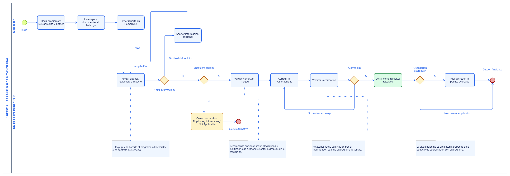

# Example: HackerOne report lifecycle

A real modeling example created through **MCP-Bizagi 0.7.0-alpha.1** and the
installed **Bizagi Modeler 4.3.0.008** engine on September 17, 2026.

## The request

> Create a diagram describing the process of the HackerOne bug bounty platform.

The requested model used Spanish labels. Those labels are retained here as an
example of Unicode process content; this guide and the project documentation are
in English. The diagram is a simplified reporting lifecycle, not a representation
of a particular program or instructions for testing a target.

[](diagram.svg)

[Full-size SVG](diagram.svg) · [Transparent PNG](diagram.png) · [BPMN source](source.bpmn) · [Verification receipt](verification.json)

## What it demonstrates

- Two responsibility lanes: researcher and program/triage team.
- Eleven activities, four exclusive decisions, one start and two end events.
- Twenty sequence flows, including information-request and remediation loops.
- Four annotations explaining optional managed triage, rewards, retesting and disclosure.
- Native persistence, graphical edits, offscreen rendering and guarded publication.

The original run imported BPMN, saved a native `.bpm`, reopened it in a separate
worker, applied typography and external-label adjustments through `native_mutate`,
rendered SVG/PNG, published the reviewed copy with `native_commit`, and validated
the actual published file. An independent check compared all 20 connections with
the source. The native validator returned an empty findings collection.

The displayed files are **byte-exact copies of the final native renderer output**.
They were not redrawn by Image Gen. The root README's decorative banner is separate
brand artwork, not runtime evidence.

## Reproduce the workflow

Use the [root quick start](../../README.md#quick-start). Enable native operations
and choose a writable model workspace; all file paths below are relative to it.

1. Copy `source.bpmn` into that workspace as `hackerone.bpmn`, or ask your MCP
   client to pass its complete contents to `bpmn_create` with that path.
2. Call `bpmn_validate` with `{"path":"hackerone.bpmn"}`. This performs structural
   XML checks, not native or complete behavioral validation.
3. Call `native_roundtrip`:

   ```json
   {
     "path": "hackerone.bpmn",
     "modelName": "HackerOne report lifecycle"
   }
   ```

4. Poll `operation_get` using the returned `OperationId` until terminal. On
   completion, review `Result.fidelity` and retain `Result.nativeArtifact`.
   Expected import differences include regenerated IDs and a normalized process
   name; do not assume arbitrary conversion losses are acceptable.
5. Call `native_inspect` with that artifact. Read `Result.sourceRevision` and the
   `Collaboration` ID in `Result.result.Elements`. Use the **returned native IDs**,
   not the original BPMN IDs, in further tools.
6. Call `native_render_svg` with the artifact and that `diagramId`. Poll its
   operation and inspect the SVG/PNG paths in `Result.result.Artifacts`.
7. Call `native_validate` and inspect `Result.result.Validation`; a completed
   operation means the validator ran, not necessarily that there were no findings.
8. To keep a native workspace file, call `native_commit` with the inspected
   artifact, its exact revision and a new `destinationPath`, such as
   `hackerone.bpm`. Poll it and inspect `Result.readback.nativeReadbackVerified`.
   An existing destination requires its own expected revision; never overwrite blindly.

**Presentation boundary:** `source.bpmn` is the original input, before the native
typography and label refinements. The steps above reproduce its process structure
and exercise the real engine, but do not promise pixel-identical output. To adjust
the imported model, use revision-guarded `native_mutate` batches with sparse
`Style` and explicit `LabelBounds` as described in the [style contract](../../docs/native-styles.md).
Inspect the resulting native artifact again before rendering or publishing it.

## Evidence and distribution boundaries

[`verification.json`](verification.json) contains the actual operation IDs,
artifact hashes, engine version and measured results. It is a sanitized summary,
not a bundled transcript or a promise about every possible model.

- PNG: **2952 × 1022**, RGBA with genuinely transparent corners.
- Native publication: byte identity and independent destination readback verified.
- No visible worker window or foreground takeover was observed in this run.
- Desktop Modeler GUI compatibility was **not independently tested** in this run.
- The final `.bpm` is retained privately: native containers can embed Windows
  identity and local-path metadata. Only reviewed BPMN and visual artifacts are
  distributed here; no Bizagi binaries, private logs or operator files are included.

## Process references

The business flow is based on these official HackerOne pages, consulted on
September 17, 2026:

- [Submitting reports](https://docs.hackerone.com/en/articles/8473994-submitting-reports).
- [Report states](https://docs.hackerone.com/en/articles/8475030-report-states).
- [Post-submission guide](https://docs.hackerone.com/en/articles/15518592-post-submission-guide).

Rewards and disclosure are optional and program-dependent. The model omits less
common states, mediation, expiration rules and payment administration. It is not
an official HackerOne diagram and does not imply affiliation or endorsement.

[Back to MCP-Bizagi](../../README.md#real-example)
