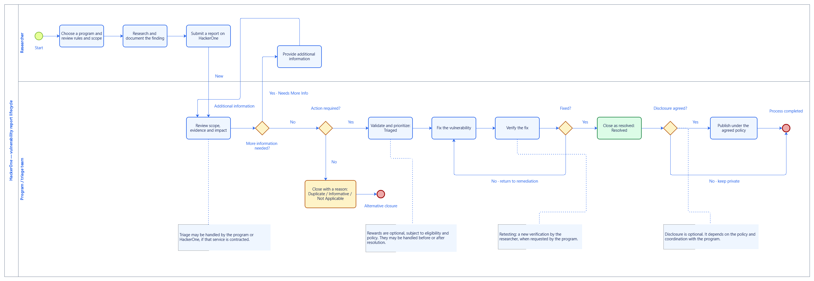

# Example: HackerOne report lifecycle — English edition

An English-language alternative to the [original Spanish example](../README.md),
created through **MCP-Bizagi 0.7.0-alpha.1** and the installed
**Bizagi Modeler 4.3.0.008** engine on October 3, 2026 (America/Lima).

[Full-size SVG](diagram.svg) · [Transparent PNG](diagram.png) ·
[English BPMN source](source.bpmn) · [Verification receipt](verification.json)

## What changed

- Visible pool, diagram, lane, activity, event, decision and connector labels are in English.
- All four annotations and the existing element descriptions were translated.
- HackerOne state names, including `New`, `Needs More Info`, `Triaged` and
  `Resolved`, retain their official English spelling.
- Native element identities, node geometry, sequence-flow endpoints and connector
  routes were preserved. One external label rectangle was widened for the English text.
- The Spanish original was not overwritten; its published artifact hashes still match.

The business process is unchanged: **11 activities, 4 exclusive gateways,
2 lanes, 20 sequence flows, 1 start event, 2 end events and 4 annotations**.
This is a simplified reporting lifecycle, not an exhaustive or official
HackerOne workflow and not a description of a particular program.

## Actual MCP workflow

The operator client used the official C# MCP SDK and the released server package
over stdio. The server launched isolated workers against the real installed engine:

1. `native_inspect` loaded a preparation copy of the final Spanish native model.
2. `native_mutate` applied revision-guarded English names, descriptions and
   `ArtifactProperties.Text` changes, then reopened the durable artifact in a fresh worker.
3. `native_diagrams_apply` renamed the diagram using its explicit lifecycle contract.
4. `native_commit` published a new English `.bpm`, verifying byte identity and
   independent destination readback.
5. `native_render_svg` generated the SVG and transparent PNG from that published file.
6. `native_validate` returned no native validation findings.
7. An independent comparison checked all 20 connections against the English BPMN
   source and checked the complete inspected graph for unintended field changes.

The visual files are **byte-exact native renderer output**, not translations painted
onto the Spanish image and not an Image Gen illustration.

## Reproduce the process

Follow the [root quick start](../../../README.md#quick-start) and the
[original example's operator workflow](../README.md#reproduce-the-workflow),
using this directory's `source.bpmn` and a new destination such as
`hackerone-english.bpm`. Never overwrite another model blindly.

**Presentation boundary:** this BPMN source translates the original XML input,
which predates the native typography and label refinements. It reproduces the
same English process structure, but an import alone does not promise pixel-identical
output. This edition was produced by translating the final native model instead.

## Evidence and distribution

The [sanitized receipt](verification.json) records actual operation IDs, engine
version, measured counts, durable readback, transparency and artifact hashes.
Raw MCP transcripts and the native `.bpm` remain local because their metadata can
contain operator identity and local paths. Only reviewed, portable artifacts are published.

An attempted rename of the hidden workflow-process metadata was rejected by the
fidelity gate because Bizagi also changes its runtime JSON. The published model
remained unchanged: that internal source name is retained, while visible diagram
labels and the portable BPMN source are in English. This run did not weaken the
preservation policy or use the rejected artifact.

No worker window or foreground takeover was observed. Independent desktop-GUI
compatibility was not tested in this run and is not inferred from native rendering.

The business-flow references and their original consultation date are documented
in the [Spanish example's English guide](../README.md#process-references).
Rewards and disclosure remain optional and program-dependent.

[Back to MCP-Bizagi](../../../README.md#real-example)
